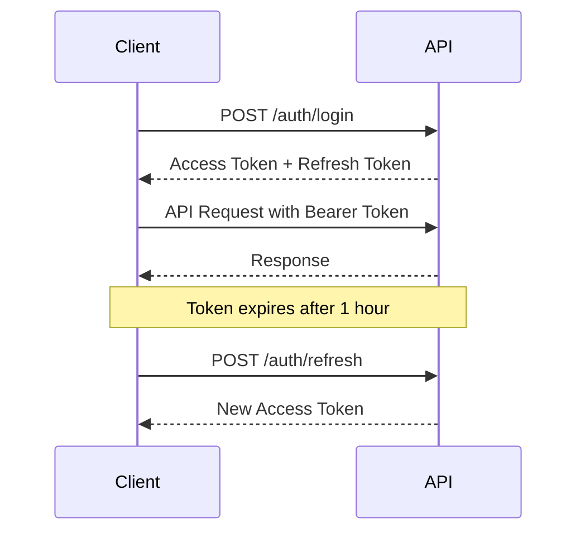

# Enterprise URL Shortener API Documentation

Welcome to the Enterprise URL Shortener API! This comprehensive guide will help you integrate with our powerful URL shortening service.

## 📋 Table of Contents

- [Overview](#overview)
- [Getting Started](#getting-started)
- [Authentication](#authentication)
- [API Reference](#api-reference)
- [Rate Limiting](#rate-limiting)
- [Error Handling](#error-handling)
- [Code Examples](#code-examples)
- [Webhooks](#webhooks)
- [SDKs and Libraries](#sdks-and-libraries)

## 🌟 Overview

The Enterprise URL Shortener API provides a robust platform for creating, managing, and analyzing short URLs. Our API is designed for high-performance applications requiring enterprise-grade features.

### Key Features

- 🔐 **JWT Authentication** - Secure token-based authentication
- 📊 **Advanced Analytics** - Detailed click tracking and reporting
- ⚡ **Rate Limiting** - Intelligent abuse protection
- 🏷️ **Tagging System** - Organize URLs with custom tags
- ⏰ **URL Expiration** - Set automatic expiration dates
- 📱 **Device Detection** - Track clicks by device type
- 🌍 **Geolocation** - Geographic click analytics
- 🔗 **Custom Slugs** - Branded short URLs
- 📈 **Real-time Metrics** - Live dashboard updates

### Base URLs

| Environment | URL |
|-------------|-----|
| Production  | `https://api.urlshortener.com` |
| Development | `http://localhost:3000` |

## 🚀 Getting Started

### Prerequisites

- API account (sign up at our dashboard)
- Basic understanding of REST APIs
- HTTP client (curl, Postman, or programming language)

### Quick Start

1. **Register an Account**
   ```bash
   curl -X POST https://api.urlshortener.com/auth/register \
     -H "Content-Type: application/json" \
     -d '{
       "email": "your@email.com",
       "password": "SecurePassword123!",
       "name": "Your Name",
       "organization": "Your Company"
     }'
   ```

2. **Get Your Access Token**
   ```bash
   curl -X POST https://api.urlshortener.com/auth/login \
     -H "Content-Type: application/json" \
     -d '{
       "email": "your@email.com",
       "password": "SecurePassword123!"
     }'
   ```

3. **Create Your First Short URL**
   ```bash
   curl -X POST https://api.urlshortener.com/urls \
     -H "Content-Type: application/json" \
     -H "Authorization: Bearer YOUR_ACCESS_TOKEN" \
     -d '{
       "originalUrl": "https://www.your-long-url.com/path",
       "title": "My First Short URL"
     }'
   ```

## 🔐 Authentication

The API uses JSON Web Tokens (JWT) for authentication. All authenticated endpoints require an `Authorization` header with a Bearer token.

### Authentication Flow



### Token Management

- **Access Token**: Valid for 1 hour, use for API requests
- **Refresh Token**: Valid for 30 days, use to get new access tokens
- **Token Rotation**: Refresh tokens are rotated on each use

### Example Authentication

```javascript
// Login and get tokens
const response = await fetch('https://api.urlshortener.com/auth/login', {
  method: 'POST',
  headers: {
    'Content-Type': 'application/json'
  },
  body: JSON.stringify({
    email: 'user@example.com',
    password: 'password123'
  })
});

const { data } = await response.json();
const accessToken = data.tokens.accessToken;

// Use token in subsequent requests
const urlResponse = await fetch('https://api.urlshortener.com/urls', {
  headers: {
    'Authorization': `Bearer ${accessToken}`,
    'Content-Type': 'application/json'
  }
});
```

## 📚 API Reference

### Authentication Endpoints

#### Register User
Creates a new user account and returns authentication tokens.

```http
POST /auth/register
Content-Type: application/json

{
  "email": "user@example.com",
  "password": "SecurePassword123!",
  "name": "John Doe",
  "organization": "Acme Corp"
}
```

**Response (201 Created):**
```json
{
  "success": true,
  "message": "User registered successfully",
  "data": {
    "user": {
      "id": 123,
      "email": "user@example.com",
      "name": "John Doe",
      "organization": "Acme Corp",
      "createdAt": "2024-01-15T10:30:00Z"
    },
    "tokens": {
      "accessToken": "eyJhbGciOiJIUzI1NiIsInR5cCI6IkpXVCJ9...",
      "refreshToken": "eyJhbGciOiJIUzI1NiIsInR5cCI6IkpXVCJ9...",
      "expiresIn": 3600
    }
  }
}
```

#### User Login
Authenticates a user and returns JWT tokens.

```http
POST /auth/login
Content-Type: application/json

{
  "email": "user@example.com",
  "password": "SecurePassword123!"
}
```

#### Refresh Token
Gets a new access token using a refresh token.

```http
POST /auth/refresh
Content-Type: application/json

{
  "refreshToken": "eyJhbGciOiJIUzI1NiIsInR5cCI6IkpXVCJ9..."
}
```

### URL Management Endpoints

#### Create Short URL
Creates a new short URL with optional custom slug and expiration.

```http
POST /urls
Authorization: Bearer {token}
Content-Type: application/json

{
  "originalUrl": "https://www.example.com/very/long/url/path",
  "title": "Example Website",
  "customSlug": "example",
  "expiresAt": "2024-12-31T23:59:59Z",
  "tags": ["web", "example"]
}
```

**Response (201 Created):**
```json
{
  "success": true,
  "message": "URL created successfully",
  "data": {
    "id": 456,
    "originalUrl": "https://www.example.com/very/long/url/path",
    "shortUrl": "https://short.ly/example",
    "shortCode": "example",
    "title": "Example Website",
    "clicks": 0,
    "isActive": true,
    "expiresAt": "2024-12-31T23:59:59Z",
    "createdAt": "2024-01-15T10:30:00Z",
    "updatedAt": "2024-01-15T10:30:00Z",
    "tags": ["web", "example"]
  }
}
```

#### List URLs
Retrieves a paginated list of URLs with filtering and sorting options.

```http
GET /urls?page=1&limit=20&search=github&tag=development&sortBy=clicks&sortOrder=desc
Authorization: Bearer {token}
```

**Query Parameters:**
- `page` (integer): Page number (default: 1)
- `limit` (integer): Items per page (default: 20, max: 100)
- `search` (string): Search in title or original URL
- `tag` (string): Filter by tag
- `sortBy` (string): Sort field (`createdAt`, `updatedAt`, `clicks`, `title`)
- `sortOrder` (string): Sort order (`asc`, `desc`)

#### Get URL Details
Retrieves detailed information about a specific URL.

```http
GET /urls/{id}
Authorization: Bearer {token}
```

#### Update URL
Updates URL title, tags, expiration, or active status.

```http
PUT /urls/{id}
Authorization: Bearer {token}
Content-Type: application/json

{
  "title": "Updated Title",
  "tags": ["updated", "example"],
  "expiresAt": "2024-12-31T23:59:59Z",
  "isActive": true
}
```

#### Delete URL
Permanently deletes a URL (cannot be undone).

```http
DELETE /urls/{id}
Authorization: Bearer {token}
```

### Redirect Endpoint

#### URL Redirect
Redirects to the original URL and tracks analytics.

```http
GET /{shortCode}
```

**Response (302 Found):**
```http
Location: https://www.example.com/original/url
```

### Analytics Endpoints

#### URL Analytics
Retrieves detailed analytics for a specific URL.

```http
GET /analytics/urls/{id}?period=30d&granularity=day
Authorization: Bearer {token}
```

**Query Parameters:**
- `period` (string): Time period (`24h`, `7d`, `30d`, `90d`, `1y`)
- `granularity` (string): Data granularity (`hour`, `day`, `week`, `month`)

**Response:**
```json
{
  "success": true,
  "message": "Analytics retrieved successfully",
  "data": {
    "url": {
      "id": 456,
      "shortCode": "example",
      "title": "Example Website",
      "totalClicks": 1542
    },
    "period": "30d",
    "summary": {
      "totalClicks": 1542,
      "uniqueClicks": 987,
      "clicksToday": 45,
      "averageClicksPerDay": 51.4
    },
    "clickHistory": [
      {
        "date": "2024-01-15",
        "clicks": 45,
        "uniqueClicks": 32
      }
    ],
    "geography": [
      {
        "country": "US",
        "clicks": 654,
        "percentage": 42.4
      }
    ],
    "referrers": [
      {
        "referrer": "google.com",
        "clicks": 445,
        "percentage": 28.9
      }
    ],
    "devices": [
      {
        "device": "desktop",
        "clicks": 892,
        "percentage": 57.9
      }
    ],
    "browsers": [
      {
        "browser": "Chrome",
        "clicks": 789,
        "percentage": 51.2
      }
    ]
  }
}
```

#### Dashboard Analytics
Retrieves overview analytics for the user's account.

```http
GET /analytics/dashboard?period=30d
Authorization: Bearer {token}
```

## ⚡ Rate Limiting

API requests are rate limited to prevent abuse and ensure service quality.

### Rate Limits

| User Type | Requests per Hour | Burst Limit |
|-----------|------------------|-------------|
| Authenticated | 1,000 | 50 |
| Anonymous | 100 | 10 |

### Rate Limit Headers

All API responses include rate limiting information:

```http
X-RateLimit-Limit: 1000
X-RateLimit-Remaining: 999
X-RateLimit-Reset: 1642681200
X-RateLimit-Window: 3600
```

### Handling Rate Limits

When you exceed the rate limit, you'll receive a `429 Too Many Requests` response:

```json
{
  "success": false,
  "error": "RATE_LIMITED",
  "message": "Rate limit exceeded. Try again in 3600 seconds.",
  "retryAfter": 3600
}
```

**Best Practices:**
- Check `X-RateLimit-Remaining` header before making requests
- Implement exponential backoff when rate limited
- Use bulk operations when available
- Cache responses to reduce API calls

## ❗ Error Handling

The API uses conventional HTTP response codes and returns detailed error information.

### HTTP Status Codes

| Code | Meaning |
|------|---------|
| 200 | OK - Request successful |
| 201 | Created - Resource created successfully |
| 400 | Bad Request - Invalid request parameters |
| 401 | Unauthorized - Invalid or missing authentication |
| 403 | Forbidden - Insufficient permissions |
| 404 | Not Found - Resource not found |
| 409 | Conflict - Resource already exists |
| 429 | Too Many Requests - Rate limit exceeded |
| 500 | Internal Server Error - Server error |

### Error Response Format

All errors follow a consistent format:

```json
{
  "success": false,
  "error": "ERROR_CODE",
  "message": "Human-readable error message",
  "details": [
    {
      "field": "email",
      "message": "Invalid email format"
    }
  ]
}
```

### Common Error Codes

| Error Code | Description |
|------------|-------------|
| `VALIDATION_ERROR` | Request validation failed |
| `INVALID_CREDENTIALS` | Login credentials are invalid |
| `TOKEN_EXPIRED` | Access token has expired |
| `TOKEN_INVALID` | Access token is malformed or invalid |
| `USER_EXISTS` | User with email already exists |
| `URL_NOT_FOUND` | Short URL does not exist |
| `URL_EXPIRED` | Short URL has expired |
| `SLUG_EXISTS` | Custom slug already taken |
| `RATE_LIMITED` | Too many requests |
| `INSUFFICIENT_PERMISSIONS` | User lacks required permissions |

### Error Handling Example

```javascript
async function createShortUrl(url, title) {
  try {
    const response = await fetch('https://api.urlshortener.com/urls', {
      method: 'POST',
      headers: {
        'Authorization': `Bearer ${accessToken}`,
        'Content-Type': 'application/json'
      },
      body: JSON.stringify({ originalUrl: url, title })
    });

    const data = await response.json();

    if (!response.ok) {
      if (response.status === 401) {
        // Handle authentication error
        await refreshToken();
        return createShortUrl(url, title); // Retry
      } else if (response.status === 429) {
        // Handle rate limiting
        const retryAfter = parseInt(response.headers.get('X-RateLimit-Reset'));
        throw new Error(`Rate limited. Retry after ${retryAfter} seconds`);
      } else {
        // Handle other errors
        throw new Error(data.message || 'API request failed');
      }
    }

    return data.data;
  } catch (error) {
    console.error('Failed to create short URL:', error.message);
    throw error;
  }
}
```

## 💻 Code Examples

### cURL Examples

#### Create a Short URL
```bash
curl -X POST https://api.urlshortener.com/urls \
  -H "Authorization: Bearer YOUR_ACCESS_TOKEN" \
  -H "Content-Type: application/json" \
  -d '{
    "originalUrl": "https://www.example.com/very/long/url",
    "title": "Example Website",
    "tags": ["example", "demo"]
  }'
```

#### Get Analytics
```bash
curl -X GET "https://api.urlshortener.com/analytics/urls/123?period=30d" \
  -H "Authorization: Bearer YOUR_ACCESS_TOKEN"
```

### JavaScript Examples

#### Using Fetch API
```javascript
class URLShortenerAPI {
  constructor(accessToken, baseURL = 'https://api.urlshortener.com') {
    this.accessToken = accessToken;
    this.baseURL = baseURL;
  }

  async request(endpoint, options = {}) {
    const url = `${this.baseURL}${endpoint}`;
    const headers = {
      'Content-Type': 'application/json',
      ...options.headers
    };

    if (this.accessToken) {
      headers.Authorization = `Bearer ${this.accessToken}`;
    }

    const response = await fetch(url, {
      ...options,
      headers
    });

    const data = await response.json();

    if (!response.ok) {
      throw new Error(data.message || `HTTP ${response.status}`);
    }

    return data.data;
  }

  async createURL(originalUrl, options = {}) {
    return this.request('/urls', {
      method: 'POST',
      body: JSON.stringify({
        originalUrl,
        ...options
      })
    });
  }

  async getURLs(params = {}) {
    const query = new URLSearchParams(params).toString();
    return this.request(`/urls?${query}`);
  }

  async getAnalytics(urlId, period = '30d') {
    return this.request(`/analytics/urls/${urlId}?period=${period}`);
  }

  async getDashboard(period = '30d') {
    return this.request(`/analytics/dashboard?period=${period}`);
  }
}

// Usage
const api = new URLShortenerAPI('your-access-token');

try {
  const shortUrl = await api.createURL('https://example.com', {
    title: 'Example Site',
    customSlug: 'example',
    tags: ['demo', 'test']
  });
  console.log('Short URL created:', shortUrl.shortUrl);
} catch (error) {
  console.error('Error:', error.message);
}
```

#### Using Axios
```javascript
const axios = require('axios');

const api = axios.create({
  baseURL: 'https://api.urlshortener.com',
  headers: {
    'Authorization': 'Bearer YOUR_ACCESS_TOKEN',
    'Content-Type': 'application/json'
  }
});

// Interceptor for error handling
api.interceptors.response.use(
  response => response.data.data,
  error => {
    if (error.response?.status === 401) {
      // Handle token refresh
      return refreshTokenAndRetry(error);
    }
    throw new Error(error.response?.data?.message || error.message);
  }
);

// Create short URL
async function createShortURL() {
  try {
    const shortUrl = await api.post('/urls', {
      originalUrl: 'https://www.example.com',
      title: 'Example Website'
    });
    console.log('Created:', shortUrl.shortUrl);
  } catch (error) {
    console.error('Error:', error.message);
  }
}
```

### Python Examples

#### Using requests
```python
import requests
import json
from datetime import datetime, timedelta

class URLShortenerAPI:
    def __init__(self, access_token, base_url='https://api.urlshortener.com'):
        self.access_token = access_token
        self.base_url = base_url
        self.session = requests.Session()
        self.session.headers.update({
            'Authorization': f'Bearer {access_token}',
            'Content-Type': 'application/json'
        })

    def _request(self, method, endpoint, **kwargs):
        url = f"{self.base_url}{endpoint}"
        response = self.session.request(method, url, **kwargs)

        if not response.ok:
            error_data = response.json()
            raise Exception(f"API Error: {error_data.get('message', 'Unknown error')}")

        return response.json()['data']

    def create_url(self, original_url, title=None, custom_slug=None, expires_at=None, tags=None):
        """Create a short URL"""
        payload = {'originalUrl': original_url}

        if title:
            payload['title'] = title
        if custom_slug:
            payload['customSlug'] = custom_slug
        if expires_at:
            payload['expiresAt'] = expires_at.isoformat()
        if tags:
            payload['tags'] = tags

        return self._request('POST', '/urls', json=payload)

    def get_urls(self, page=1, limit=20, search=None, tag=None, sort_by='createdAt', sort_order='desc'):
        """Get user's URLs with pagination and filtering"""
        params = {
            'page': page,
            'limit': limit,
            'sortBy': sort_by,
            'sortOrder': sort_order
        }

        if search:
            params['search'] = search
        if tag:
            params['tag'] = tag

        return self._request('GET', '/urls', params=params)

    def get_analytics(self, url_id, period='30d', granularity='day'):
        """Get analytics for a specific URL"""
        params = {'period': period, 'granularity': granularity}
        return self._request('GET', f'/analytics/urls/{url_id}', params=params)

    def get_dashboard(self, period='30d'):
        """Get dashboard analytics"""
        params = {'period': period}
        return self._request('GET', '/analytics/dashboard', params=params)

# Usage example
if __name__ == '__main__':
    api = URLShortenerAPI('your-access-token')

    try:
        # Create a short URL
        short_url = api.create_url(
            original_url='https://www.example.com/very/long/path',
            title='Example Website',
            custom_slug='example-2024',
            expires_at=datetime.now() + timedelta(days=365),
            tags=['example', 'demo']
        )

        print(f"Short URL created: {short_url['shortUrl']}")
        print(f"Short code: {short_url['shortCode']}")

        # Get analytics
        analytics = api.get_analytics(short_url['id'], period='7d')
        print(f"Total clicks: {analytics['summary']['totalClicks']}")

    except Exception as e:
        print(f"Error: {e}")
```

### PHP Examples

```php
<?php

class URLShortenerAPI {
    private $accessToken;
    private $baseURL;

    public function __construct($accessToken, $baseURL = 'https://api.urlshortener.com') {
        $this->accessToken = $accessToken;
        $this->baseURL = $baseURL;
    }

    private function request($method, $endpoint, $data = null) {
        $url = $this->baseURL . $endpoint;

        $headers = [
            'Authorization: Bearer ' . $this->accessToken,
            'Content-Type: application/json'
        ];

        $ch = curl_init();
        curl_setopt_array($ch, [
            CURLOPT_URL => $url,
            CURLOPT_RETURNTRANSFER => true,
            CURLOPT_CUSTOMREQUEST => $method,
            CURLOPT_HTTPHEADER => $headers,
            CURLOPT_SSL_VERIFYPEER => false
        ]);

        if ($data) {
            curl_setopt($ch, CURLOPT_POSTFIELDS, json_encode($data));
        }

        $response = curl_exec($ch);
        $httpCode = curl_getinfo($ch, CURLINFO_HTTP_CODE);
        curl_close($ch);

        $decodedResponse = json_decode($response, true);

        if ($httpCode >= 400) {
            throw new Exception($decodedResponse['message'] ?? 'API Error');
        }

        return $decodedResponse['data'];
    }

    public function createURL($originalUrl, $options = []) {
        $data = array_merge(['originalUrl' => $originalUrl], $options);
        return $this->request('POST', '/urls', $data);
    }

    public function getURLs($params = []) {
        $queryString = http_build_query($params);
        $endpoint = '/urls' . ($queryString ? '?' . $queryString : '');
        return $this->request('GET', $endpoint);
    }

    public function getAnalytics($urlId, $period = '30d') {
        return $this->request('GET', "/analytics/urls/{$urlId}?period={$period}");
    }

    public function getDashboard($period = '30d') {
        return $this->request('GET', "/analytics/dashboard?period={$period}");
    }
}

// Usage
try {
    $api = new URLShortenerAPI('your-access-token');

    // Create short URL
    $shortUrl = $api->createURL('https://www.example.com', [
        'title' => 'Example Website',
        'customSlug' => 'example',
        'tags' => ['demo', 'test']
    ]);

    echo "Short URL created: " . $shortUrl['shortUrl'] . PHP_EOL;

    // Get URLs with pagination
    $urls = $api->getURLs([
        'page' => 1,
        'limit' => 10,
        'sortBy' => 'clicks',
        'sortOrder' => 'desc'
    ]);

    echo "Total URLs: " . $urls['pagination']['totalItems'] . PHP_EOL;

} catch (Exception $e) {
    echo "Error: " . $e->getMessage() . PHP_EOL;
}
?>
```

## 🔔 Webhooks

Enterprise URL Shortener supports webhooks to notify your application of events in real-time.

### Supported Events

- `url.created` - New URL created
- `url.clicked` - URL was clicked
- `url.expired` - URL expired
- `url.updated` - URL was modified
- `user.registered` - New user registered

### Webhook Configuration

Configure webhooks through the dashboard or API:

```http
POST /webhooks
Authorization: Bearer {token}
Content-Type: application/json

{
  "url": "https://your-app.com/webhooks/urlshortener",
  "events": ["url.clicked", "url.created"],
  "secret": "your-webhook-secret"
}
```

### Webhook Payload Example

```json
{
  "event": "url.clicked",
  "timestamp": "2024-01-15T10:30:00Z",
  "data": {
    "url": {
      "id": 456,
      "shortCode": "abc123",
      "originalUrl": "https://example.com"
    },
    "click": {
      "ip": "192.168.1.1",
      "userAgent": "Mozilla/5.0...",
      "referrer": "https://google.com",
      "country": "US",
      "device": "desktop",
      "browser": "Chrome"
    }
  }
}
```

### Verifying Webhooks

```javascript
const crypto = require('crypto');

function verifyWebhook(payload, signature, secret) {
  const expectedSignature = crypto
    .createHmac('sha256', secret)
    .update(payload)
    .digest('hex');

  return `sha256=${expectedSignature}` === signature;
}

// Express.js webhook handler
app.post('/webhooks/urlshortener', (req, res) => {
  const signature = req.headers['x-webhook-signature'];
  const isValid = verifyWebhook(
    JSON.stringify(req.body),
    signature,
    process.env.WEBHOOK_SECRET
  );

  if (!isValid) {
    return res.status(401).send('Invalid signature');
  }

  // Process webhook event
  console.log('Webhook event:', req.body.event);
  res.status(200).send('OK');
});
```

## 📦 SDKs and Libraries

Official SDKs are available for popular programming languages:

### JavaScript/TypeScript
```bash
npm install @urlshortener/js-sdk
```

```javascript
import { URLShortenerClient } from '@urlshortener/js-sdk';

const client = new URLShortenerClient({
  accessToken: 'your-token',
  baseURL: 'https://api.urlshortener.com'
});

const shortUrl = await client.urls.create({
  originalUrl: 'https://example.com',
  title: 'Example'
});
```

### Python
```bash
pip install urlshortener-python
```

```python
from urlshortener import URLShortenerClient

client = URLShortenerClient(access_token='your-token')
short_url = client.urls.create(
    original_url='https://example.com',
    title='Example'
)
```

### PHP
```bash
composer require urlshortener/php-sdk
```

```php
use URLShortener\Client;

$client = new Client(['access_token' => 'your-token']);
$shortUrl = $client->urls->create([
    'originalUrl' => 'https://example.com',
    'title' => 'Example'
]);
```

### Go
```bash
go get github.com/urlshortener/go-sdk
```

```go
import "github.com/urlshortener/go-sdk"

client := urlshortener.NewClient("your-token")
shortURL, err := client.URLs.Create(&urlshortener.CreateURLRequest{
    OriginalURL: "https://example.com",
    Title:       "Example",
})
```

## 📊 Postman Collection

Import our Postman collection for easy API testing:

[Download Postman Collection](./postman_collection.json)

The collection includes:
- All API endpoints with examples
- Environment variables for tokens
- Pre-request scripts for authentication
- Test scripts for response validation

## 🛠️ Interactive API Explorer

Try our interactive API explorer powered by Swagger UI:

**Production:** [https://api.urlshortener.com/docs](https://api.urlshortener.com/docs)
**Local Development:** [http://localhost:3000/docs](http://localhost:3000/docs)

Features:
- Interactive endpoint testing
- Real-time request/response examples
- Authentication integration
- Schema validation

## 📝 Changelog

### v1.0.0 (2024-01-15)
- Initial API release
- JWT authentication
- URL shortening and management
- Basic analytics
- Rate limiting

## 🤝 Support

Need help? We're here for you:

- **Documentation:** [https://docs.urlshortener.com](https://docs.urlshortener.com)
- **Support Email:** [support@urlshortener.com](mailto:support@urlshortener.com)
- **Community:** [https://community.urlshortener.com](https://community.urlshortener.com)
- **Status Page:** [https://status.urlshortener.com](https://status.urlshortener.com)

### Response Times
- **Critical Issues:** Within 2 hours
- **General Support:** Within 24 hours
- **Feature Requests:** Within 1 week

---

**Happy shortening!** 🚀

*Last updated: January 15, 2024*